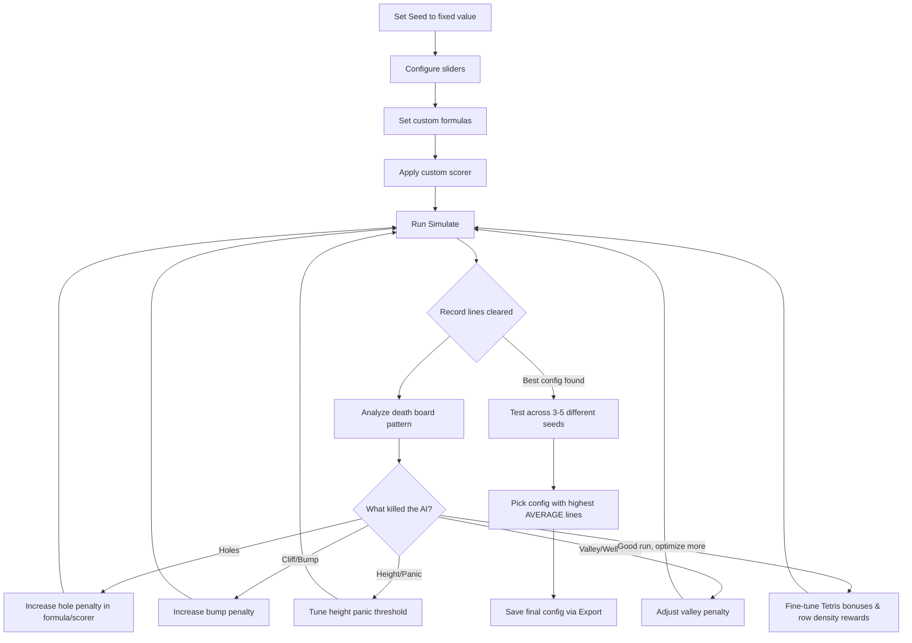

# 🏆 Winning the DBS Tetris AI Grand Prix

## Background & Problem Understanding

You're competing in the **DBS Tetris AI Grand Prix** at `tetris.therayg.com/competition.html`. The competition is scored by **total lines cleared** before Game Over. The seed is unknown until competition day.

### How the AI Works
The AI is a **greedy 1-piece lookahead** heuristic. For each new piece, it:
1. Simulates **every possible placement** (4 rotations × 10 positions × 2 pieces [current + hold]) = up to 80 candidates
2. Scores each using **5 weighted metrics + custom scorer**
3. Picks the **highest score** (least negative)

### The Scoring Formula (from source code)
```
score = (linesCleared × wLines × 100)
      + (holes × wHoles × 5)
      + (bumpiness × wBump)
      + (aggregateHeight × wHeight)
      + (valleyDepth × wValley)
      + customScorer(board, linesCleared)
      + (gameOverPenalty: -100,000 if top row filled)
```

### What We've Learned (Baseline)
From the initial simulation run with seed 42:
- **Default aggressive settings** (Lines: 2.0, Holes: -2.0, Bump: -1.0, Height: -0.10, Valley: -1.0) → **2,521 lines**
- The board shows a "cliff on the right" death pattern — the AI creates tall right-side pillars
- I-Piece probability was 8.17% (1 in 12), lower than the expected 14.3% — bad luck contributes to death
- High score so far: **6,727,900 points / 1,374 lines** (from a previous run)

---

## Proposed Strategy: 3-Level Optimization

The plan attacks all 3 competition levels simultaneously, since they're additive.

### Level 1: Beginner — Slider Weights

> [!IMPORTANT]
> The slider range is constrained: Lines [0, 2], Holes [-2, 0], Bump [-1, 0], Height [-0.10, 0], Valley [-1, 0]. We're already at max for Lines and Holes. The differentiation must come from Bump/Height/Valley tuning.

**Configurations to test** (all on the same seed, to A/B test):

| Config | Lines | Holes | Bump | Height | Valley | Hypothesis |
|--------|-------|-------|------|--------|--------|------------|
| A (Baseline) | 2.0 | -2.0 | -1.0 | -0.10 | -1.0 | Current best ~2,521 lines |
| B (Soft Valley) | 2.0 | -2.0 | -1.0 | -0.10 | -0.5 | Allow controlled wells for I-piece Tetrises |
| C (Soft Bump) | 2.0 | -2.0 | -0.5 | -0.10 | -1.0 | Let the AI be more flexible with surface |
| D (Max Penalty) | 2.0 | -2.0 | -1.0 | -0.10 | -1.0 | Same as A, but with formula amplification |
| E (Balanced) | 2.0 | -2.0 | -0.7 | -0.05 | -0.7 | More balanced, less panic |
| F (Height Focus) | 2.0 | -2.0 | -0.8 | -0.10 | -0.8 | Keep board extra low |

---

### Level 2: Intermediate — Formula Tuning

This is where the big gains come from. Instead of `holes * wHoles * 5` (linear), we can make the penalties **non-linear** to create "panic" behavior.

**Default formulas** (from participant guide):
```
Lines:  lines * wLines * 100
Holes:  holes * wHoles * 5
Bump:   bump * wBump
Height: height * wHeight
Valley: valley * wValley
```

**Proposed custom formulas:**

| Metric | Formula | Rationale |
|--------|---------|-----------|
| Lines | `lines * wLines * 100` | Keep default — already heavily rewarded |
| Holes | `holes * holes * wHoles * 3` | **Quadratic penalty** — 1 hole = mild, 5 holes = catastrophic. The `holes²` makes 10 holes 10× worse than 3 holes instead of just 3.3× worse |
| Bump | `bump * wBump * 1.5` | Amplify bumpiness penalty by 50% beyond slider max |
| Height | `(height > 100 ? height * height * wHeight * 0.01 : height * wHeight)` | **Conditional panic**: normal penalty when low, exponential when aggregate height > 100 (half the board filled) |
| Valley | `valley * valley * wValley * 0.5` | Quadratic valley penalty — deep valleys are exponentially worse |

> [!TIP]
> The key insight: **non-linear hole penalty** is the single biggest improvement. A board with 0 holes should be much more desirable than one with even 1 hole, and a board with 5 holes should be treated as near-catastrophic.

---

### Level 3: Advanced — Custom Scorer JavaScript

This is the **winner's edge**. The custom scorer receives `board` (20×10 2D array) and `linesCleared` and returns a number added to the AI's score.

**Proposed Custom Scorer — "The Dominant" Strategy:**

```javascript
// === THE DOMINANT: Multi-objective Tetris Optimizer ===
let score = 0;

// 1. TETRIS BONUS: Massively reward 4-line clears
if (linesCleared === 4) score += 800;
else if (linesCleared === 3) score += 200;
else if (linesCleared === 2) score += 50;
// Single clears = slight penalty (be patient for bigger clears)
else if (linesCleared === 1) score -= 5;

// 2. WELL COLUMN STRATEGY: Keep column 9 (rightmost) clear for I-pieces
for (let r = 0; r < 20; r++) {
  if (board[r][9] !== 0) score -= 8;
}

// 3. SURFACE SMOOTHNESS: Penalize height transitions beyond bumpiness
let heights = [];
for (let c = 0; c < 10; c++) {
  let h = 0;
  for (let r = 0; r < 20; r++) {
    if (board[r][c] !== 0) { h = 20 - r; break; }
  }
  heights.push(h);
}

// 4. ROW DENSITY BONUS: Reward nearly-complete rows (8 or 9 filled)
for (let r = 0; r < 20; r++) {
  let filled = 0;
  for (let c = 0; c < 10; c++) {
    if (board[r][c] !== 0) filled++;
  }
  if (filled === 9) score += 15;   // One away from clearing!
  if (filled === 8) score += 5;    // Almost there
}

// 5. MAX HEIGHT DANGER: Exponential penalty when stack is too tall
let maxH = Math.max(...heights);
if (maxH > 14) score -= (maxH - 14) * (maxH - 14) * 20;
else if (maxH > 10) score -= (maxH - 10) * 5;

// 6. COVERED HOLES: Extra penalty for deep holes (hard to fix)
for (let c = 0; c < 10; c++) {
  let blockCount = 0;
  let foundTop = false;
  for (let r = 0; r < 20; r++) {
    if (board[r][c] !== 0) {
      foundTop = true;
      blockCount++;
    } else if (foundTop) {
      // Hole! Penalize by depth (how many blocks are above it)
      score -= blockCount * 3;
    }
  }
}

// 7. FLAT BOTTOM BONUS: Reward if bottom rows are mostly filled
let bottomDensity = 0;
for (let r = 16; r < 20; r++) {
  for (let c = 0; c < 10; c++) {
    if (board[r][c] !== 0) bottomDensity++;
  }
}
score += bottomDensity * 0.5;

return score;
```

---

## Iterative Optimization Workflow



### Phase 1: Establish Baseline (Seed 42, 123, 7777)
1. Run simulation with **default weights** on each seed → record lines
2. Run with **maxed slider weights** (A config) → record lines

### Phase 2: Formula Optimization (Same seeds)
3. Apply **quadratic hole penalty** formula → test
4. Apply **conditional height panic** formula → test
5. Apply both together → test
6. Compare results → keep best formula combination

### Phase 3: Custom Scorer (Same seeds)
7. Add the "Dominant" custom scorer → test
8. Tune individual scorer components:
   - Vary Tetris bonus (500 vs 800 vs 1000)
   - Vary well column penalty (col 9 vs col 0)
   - Vary row density bonus weight
   - Vary max height panic threshold (12 vs 14 vs 16)
9. Compare results → keep best custom scorer

### Phase 4: Cross-Seed Validation (5+ different seeds)
10. Take the top 3 configs and test each on 5 different seeds
11. Pick the config with the **highest average lines** (robust to seed variation)

### Phase 5: Competition Day
12. Enter the revealed seed
13. Apply the winning config
14. Run Simulate
15. Export as .json

---

## What We Can Control vs What We Can't

| Controllable | Not Controllable |
|---|---|
| 5 weight sliders | Random seed (unknown until day) |
| 5 custom formulas | Piece sequence (pure random, no 7-bag) |
| Custom scorer JS function | AI algo (greedy 1-piece, no look-ahead) |
| | Game speed (increases with level) |

> [!WARNING]
> The AI uses **pure random** piece generation (`Math.random() * 7`), NOT the standard 7-bag. This means I-piece droughts are more likely and devastating. The strategy must be **robust to drought** rather than dependent on I-pieces.

> [!IMPORTANT]
> Since there's no 7-bag, the "keep column 9 clear for Tetris" strategy is **riskier** than with standard Tetris. We should **test both** the well strategy and a "clear any lines aggressively" strategy and compare.

---

## Key Technical Insights

1. **Formula multipliers bypass slider limits**: The slider for Holes caps at -2.0, but the formula `holes * wHoles * 5` has a `× 5` multiplier. Changing this to `holes * wHoles * 15` effectively **triples** the penalty without touching the slider.

2. **Custom scorer stacks with formulas**: The custom scorer's return value is **added** to the formula-based score. This means we can use it for strategies that the 5-metric system can't express (row density, well control, height zones).

3. **The `board` array**: `board[0][0]` = top-left, `board[19][9]` = bottom-right. 0 = empty, non-zero = filled.

4. **Lines are cleared BEFORE other metrics are evaluated**: A line-clearing move automatically improves height/holes/bumpiness scores too. Double-counting actually helps.

---

## Verification Plan

### Automated Testing
- Run each configuration via the **Simulate** button on the competition page
- Test each config on at least 3 different seeds (42, 123, 7777)
- Record lines cleared, score, level reached, I-piece probability, and death pattern

### Success Criteria
- **Minimum target**: 5,000+ lines (2× current baseline of 2,521)
- **Competitive target**: 15,000+ lines (approaching the 16,685 example in slides)
- **Winner target**: 20,000+ lines

### Final Validation
- Once best config is found, run on 5 different seeds and verify **average > 10,000 lines**
- Check that death patterns are diverse (not always the same failure mode)
